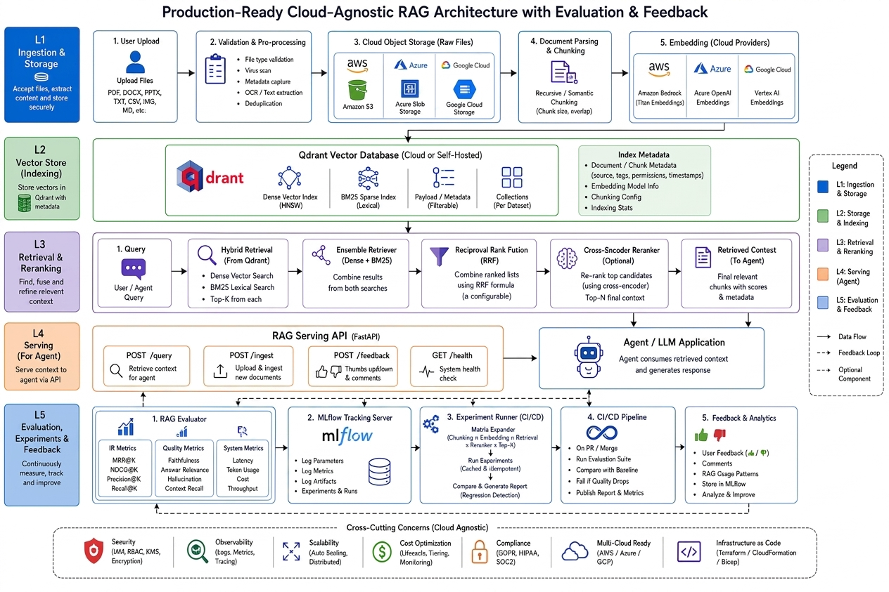

# Mentera RAG Pipeline

A production-grade, cloud-agnostic, multi-tenant **Retrieval-Augmented Generation (RAG) Context Pipeline** built with Python 3.11+, FastAPI, Qdrant, AWS Bedrock, Azure OpenAI, GCP Vertex AI, and MLflow.

Serves retrieved context with strict tenant payload isolation to downstream Agent and LLM applications.

---

## 🌟 Key Features & Capabilities

- **Multi-Tenant Isolation**: Single shared Qdrant collection isolated via mandatory `tenant_id`, `provider_id`, and optional `patient_id` payload filters on every query.
- **Direct Cloud Upload Flow**: Presigned upload URL architecture (`POST /upload/presign`) decoupling file transfer from API execution for arbitrarily large files.
- **Document Parsing Suite**: Automated parsers for PDF (PyMuPDF), Plain Text, Markdown, and Image OCR (Tesseract). Includes SHA-256 content deduplication.
- **Multi-Cloud Embeddings**: Pluggable embedding providers for AWS Bedrock (Titan v2, Cohere Embed v3), Azure OpenAI (`text-embedding-3-small`/`large`), and GCP Vertex AI (`text-embedding-005`).
- **Hybrid Retrieval & RRF Fusion**: Dense vector similarity + BM25 lexical retrieval merged via weighted Reciprocal Rank Fusion (RRF) and Cross-Encoder reranking.
- **Dual Orchestration**: Low-latency linear context pipeline and self-correcting agentic state graph (LangGraph) with document relevance grading and adaptive query re-writing.
- **Observability & Experiments**: MLflow experiment tracking matrix benchmarking retrieval configuration variations.
- **Production FastAPI REST API**: Endpoints for presigning uploads (`/upload/presign`), triggering ingestion (`/ingest`), querying context (`/query`), and component health checks (`/health`).

---

## 🏗️ System Architecture



### Presigned Upload Architecture Flow
```
┌──────────┐   1. Request presigned URL    ┌─────────────────┐
│  Browser │─────────────────────────────▶│  POST /upload/  │
│  Client  │◀─────────────────────────────│  presign        │
│          │   2. Return presigned URL    │  (FastAPI)      │
│          │                              └─────────────────┘
│          │   3. PUT file directly
│          │─────────────────────────────▶┌─────────────────┐
│          │                              │  Cloud Storage  │
│          │                              │ (S3/Blob/GCS)   │
│          │                              └────────┬────────┘
│          │   4. POST /ingest with                │
│          │      storage_key + metadata           │
│          │─────────────────────────────▶┌────────▼────────┐
└──────────┘                              │  POST /ingest   │
                                          │  (FastAPI)      │
                                          │  Download →Parse│
                                          │  → Chunk →Embed │
                                          │  → Index Qdrant │
                                          └─────────────────┘
```

---

## 🚀 Quick Start Guide

### Prerequisites
- Python 3.11+
- Docker & Docker Compose

### 1. Installation

```bash
# Clone the repository
git clone git@github.com:nxgp/nx-rag.git
cd RAG

# Create virtual environment
python3 -m venv .venv
source .venv/bin/activate

# Install package and optional dependencies
pip install --upgrade pip hatchling
pip install -e ".[ocr,dev]"
```

### 2. Configure Environment Variables

```bash
cp .env.example .env
# Edit .env with your Qdrant, cloud storage, and embedding provider credentials
```

### 3. Start Infrastructure Microservices (Qdrant & MLflow)

```bash
make up
```

Services will be accessible at:
- **Qdrant Vector Store**: `http://localhost:6333`
- **MLflow Tracking UI**: `http://localhost:5000`

---

## ⚡ Running the API Service

Start the FastAPI server:

```bash
uvicorn mentera_rag.api.main:app --reload --port 8000
```

Access interactive API documentation at:
👉 **`http://localhost:8000/docs`**

### Core Endpoints:
- `POST /upload/presign`: Request presigned upload URL and storage key for cloud storage.
- `POST /ingest`: Trigger ingestion pipeline (download, parse, chunk, embed, index) for uploaded object.
- `POST /query`: Retrieve top-k context chunks with tenant payload filtering (`tenant_id`, `provider_id`).
- `GET /health`: Component-level health check (Qdrant + Cloud Storage).

---

## 🛡️ Testing & Quality Gates

Run all quality checks, static analysis, and tests:

```bash
make check
```

Or run individual gates manually:

```bash
# Code linting & formatting (Ruff)
ruff check .
ruff format --check .

# Static type checking (Mypy)
mypy src/

# Security audit (Bandit)
bandit -r src/ -x tests/

# Automated unit & integration test suite (Pytest)
pytest --cov=src/mentera_rag tests/
```

---

## 📄 License & Version
- **Version**: `2.0.0`
- **Package**: `mentera_rag`
- **License**: MIT
